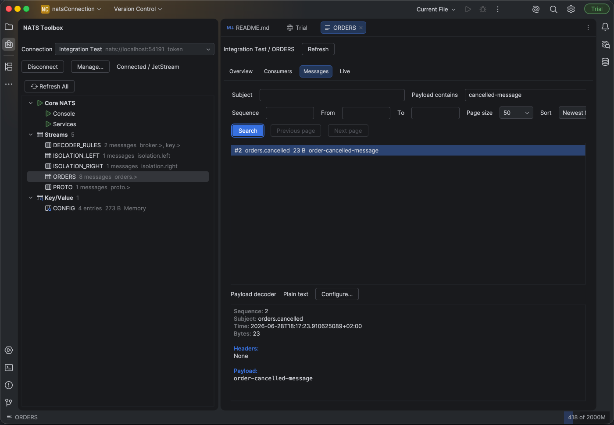
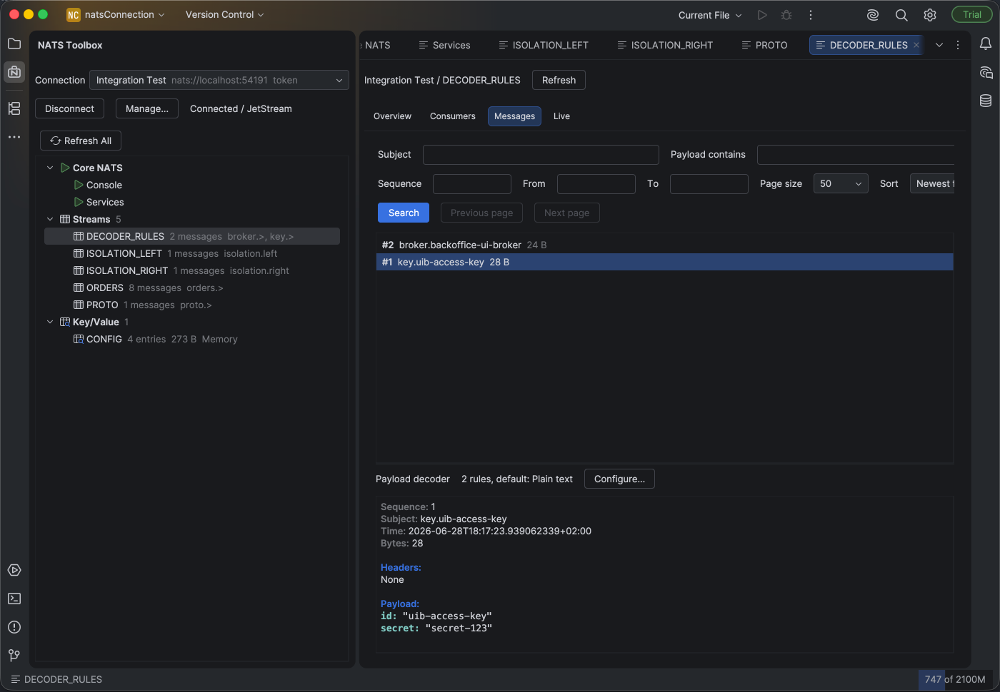
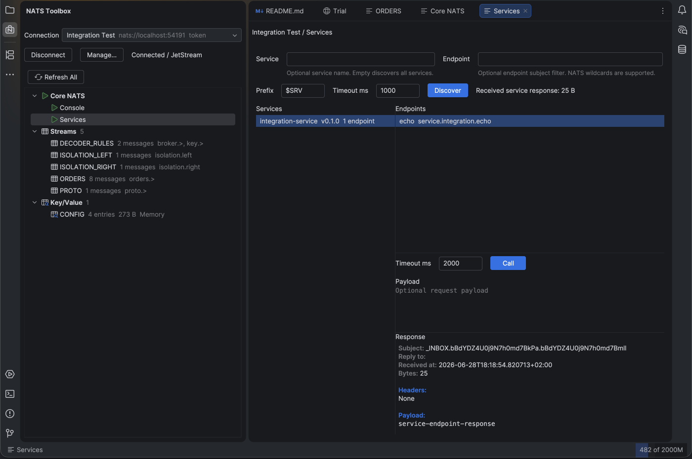

## Find the message you actually need

Search JetStream messages by subject, sequence, sequence range, or payload
substring. Choose oldest-first or newest-first ordering, paginate through large
streams, and see matching batches as they arrive.

## Understand payloads, not byte arrays

Read plain text and hexadecimal payloads, or decode Protocol Buffers from a
`.proto` file or descriptor set. Subject-based decoder rules let different
message types coexist in the same stream.

- Plain text and hex views
- Protocol Buffers with per-subject rules
- Headers, metadata, timestamps, and payload size
- The same decoding workflow for JetStream, Core NATS, and Key/Value

## Explore services and call endpoints

Discover running NATS services through the standard service protocol. Inspect
instances, endpoints, request counts, errors, and latency, then call an endpoint
and view its response in place.

## Keep operational context beside your code

Browse streams, consumers, and Key/Value buckets from a compact tool window.
Detailed views open as editor tabs, so you can compare NATS state with the code
that produces and consumes it.

## More than a JetStream browser

- Subscribe to multiple live stream subjects at once
- Listen to Core NATS subjects and wildcards
- Send request/reply calls with explicit timeouts
- Discover NATS services and call their endpoints
- Connect with tokens, user/password, NKeys, credentials, and TLS
- Continue using Core NATS when JetStream is unavailable

> NATS Toolbox is available as a paid JetBrains Marketplace plugin.

## Work with NATS without changing mental context

NATS Toolbox is built for developers debugging real systems: focused controls,
bounded live views, progressive results, and no separate desktop client to keep
in sync.

[Install NATS Toolbox from JetBrains Marketplace](https://plugins.jetbrains.com/plugin/32647-nats-toolbox).
